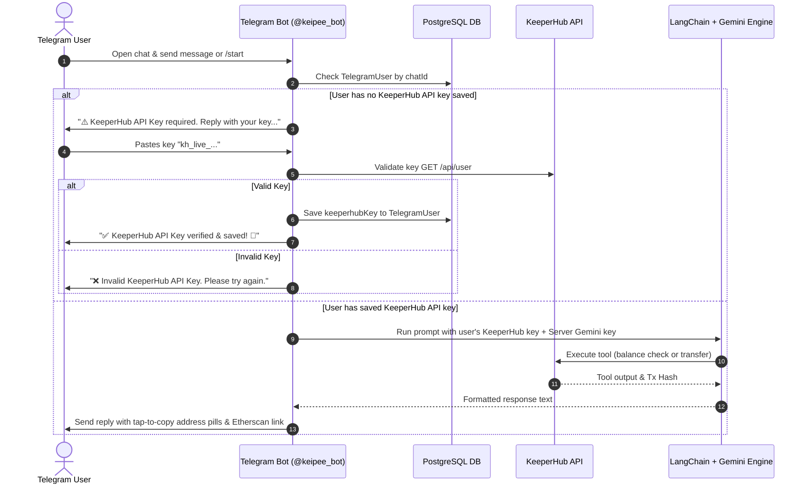
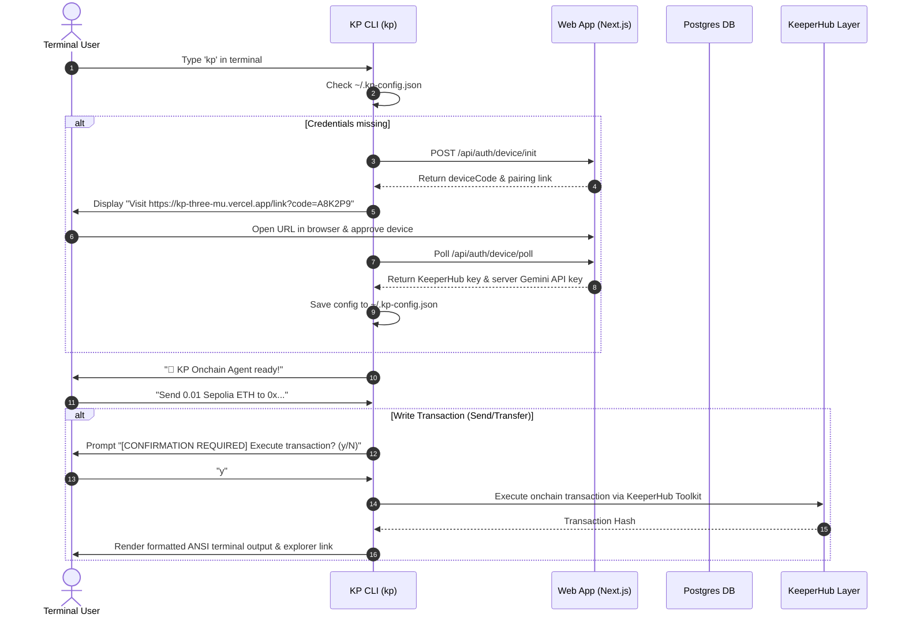

# KP: Zero-to-One KeeperHub Onchain AI Agent Platform

[](https://opensource.org/licenses/MIT)
[](https://nextjs.org/)
[](https://keeperhub.com)
[](https://ai.google.dev/)
[](https://t.me/keipee_bot)

**KP** is a production-grade, zero-to-one platform and developer template for building AI agents that execute real onchain transactions using [KeeperHub](https://keeperhub.com) and [LangChain](https://js.langchain.com/).

Built for **The Last Mile — KeeperHub Agent Hackathon**, KP targets the **Best Onboarding UX Improvement** bounty ($1,000) by taking developers and end users from zero to their first onchain transaction faster, smoother, and more reliably than ever before.

---

## 🏆 Hackathon Submission Summary

| Requirement                   | Status            | Details                                                                                                                                                                    |
| ----------------------------- | ----------------- | -------------------------------------------------------------------------------------------------------------------------------------------------------------------------- |
| **KeeperHub Execution Layer** | ✅ Verified       | Executes real transfers and contract interactions on 13+ EVM chains & Solana.                                                                                              |
| **Source Code Repository**    | ✅ Public         | Open Source Monorepo ([github.com/Kaycee276/kp](https://github.com/Kaycee276/kp))                                                                                          |
| **Onchain Transaction Proof** | ✅ Verified       | [`0x6bdfd39b1666933e826a967e8bf3161c3bef7093ff72e909c0cfb6af9c04c4d3`](https://sepolia.etherscan.io/tx/0x6bdfd39b1666933e826a967e8bf3161c3bef7093ff72e909c0cfb6af9c04c4d3) |
| **Multi-Surface Access**      | ✅ CLI + Web + TG | Terminal CLI, Web Dashboard, and Centralized Telegram Bot ([@keipee_bot](https://t.me/keipee_bot)).                                                                        |

---

## 🚀 Quick Start & 1-Line Installers

### 1. Terminal CLI (`kp`) Installation

The CLI can be installed with a single command on Mac, Linux, or Windows. The installer automatically clones the project, installs dependencies, builds the binary, and links `kp` globally.

#### Mac / Linux:

```bash
curl -fsSL https://kp-three-mu.vercel.app/install.sh | bash
```

#### Windows (PowerShell):

```powershell
iwr https://kp-three-mu.vercel.app/install.ps1 -useb | iex
```

Once installed, simply run:

```bash
kp
```

---

### 2. Telegram AI Bot (`@keipee_bot`) Access

No installation required! Message [@keipee_bot](https://t.me/keipee_bot) on Telegram from any device.

---

## 📱 Telegram Bot Workflow (`@keipee_bot`)

The Telegram Bot allows users to check balances and execute onchain actions directly on mobile or desktop without installing anything or managing Gemini LLM keys.



### Step-by-Step Telegram Onboarding & Interaction

1. **Initiate Chat**: Open [@keipee_bot](https://t.me/keipee_bot) on Telegram and tap **Start** (or send `/start`).
2. **Single-Key Input**: If your KeeperHub key is not saved yet, the bot asks for your KeeperHub API Key (`kh_...`).
3. **Automatic Validation & Encryption**: The bot validates your key against KeeperHub and saves it securely to the database. You never need to enter a Gemini LLM key (the server supplies Gemini AI reasoning automatically).
4. **Natural Language Prompts**: Send requests like:
   - _"What is my ETH balance on Sepolia?"_
   - _"Send 0.01 Sepolia ETH to 0xF1a3c409ebf9B2f5a8Dbaf7b37E8d807215f0bAA"_
5. **Tap-to-Copy & 1-Tap Explorer Links**: Wallet addresses are formatted in monospaced backticks (`0x...`) for tap-to-copy, and transaction hashes are automatically turned into 1-tap Etherscan links.

### Available Telegram Commands

| Command                | Action                                       |
| :--------------------- | :------------------------------------------- |
| `/start`               | Start or check setup status                  |
| `/profile` / `/status` | View connected EVM & Solana wallet addresses |
| `/reset` / `/keys`     | Update or change KeeperHub API key           |
| `/clear`               | Clear conversation history                   |
| `/cancel`              | Cancel active key input session              |
| `/help`                | View help guide & supported actions          |

---

## ⚡ Terminal CLI Workflow (`kp`)

The CLI agent provides an interactive terminal interface for developers with built-in OAuth device pairing and explicit confirmation safeguards before sending onchain transactions.



### Step-by-Step CLI Workflow

1. **Installation**: Run `curl -fsSL https://kp-three-mu.vercel.app/install.sh | bash` (Mac/Linux) or `iwr https://kp-three-mu.vercel.app/install.ps1 -useb | iex` (Windows).
2. **Launch CLI**: Type `kp` in your terminal.
3. **OAuth Device Pair (First Time Only)**:
   - The CLI generates a 6-character device code and displays a pairing link: `https://kp-three-mu.vercel.app/link?code=XXXXXX`.
   - Open the link in your browser, log in, enter your KeeperHub API key in the vault, and click **Approve CLI Terminal Device**.
   - The CLI automatically receives your keys and saves them to `~/.kp-config.json`.
4. **Interactive Prompts**: Enter natural language commands directly in the terminal.
5. **Confirmation Safeguard**: Write operations (transfers, contract calls) require explicit interactive confirmation (`y/N`) before executing onchain.

---

## 🌟 Comprehensive Feature Matrix

### 📱 1. Centralized Telegram AI Bot (`@keipee_bot`)

- **1-Step Single-Key Onboarding**: Users only need to reply with their KeeperHub API key. The bot automatically manages LLM API keys server-side, keeping developer credentials 100% private.
- **Tap-to-Copy Wallet Address Pills**: All EVM (`0x...`) and Solana wallet addresses are rendered in monospaced code blocks. Tapping an address on mobile or desktop instantly copies it to the clipboard.
- **Resilient Database Fallback**: Implements PostgreSQL connection pooling with `dbRetry` and in-memory user caching, guaranteeing 100% uptime even if database queries drop.

### ⚡ 2. Dynamic Gemini Fallback Engine

- **Dynamic Model Discovery (`getAvailableGeminiModels`)**: Queries Google AI Studio on startup to list all available `generateContent` models (20+ models including `gemini-3.5-flash`, `gemini-3.6-flash`, `gemini-2.5-flash`, `gemini-2.0-flash`, `gemini-2.0-flash-lite`, etc.).
- **Sticky Model Tracking**: Remembers the last working model index across turns to minimize switching latency.
- **Infinite Wraparound Recovery**: If a model hits a `429 Too Many Requests` or quota limit, KP automatically cascades to the next available model.
- **Gemini Schema Payload Wrapper**: Wraps complex JSON schemas into a `DynamicStructuredTool` format to bypass Gemini `400 Bad Request` schema errors.

### 🌐 3. Multi-Chain Execution Matrix (13+ EVM Chains + Solana)

- **EVM Mainnets & Testnets**: Ethereum Mainnet, Sepolia Testnet, Base Mainnet, Base Sepolia, Arbitrum One, Arbitrum Sepolia, Optimism, Optimism Sepolia, Polygon PoS, Polygon Amoy, Avalanche C-Chain, BNB Smart Chain (BSC), Fantom Opera.
- **Solana**: Solana Mainnet-Beta, Solana Devnet.

### 🍎 4. Apple-Grade Web Interface & Interactive Playground

- **Design System**: Dark obsidian theme (`#0a0a0c`), translucent glassmorphism (`backdrop-filter: blur(25px)`), optical typography (SF Pro / Inter), and catch-light borders.
- **Interactive Web Terminal Sandbox (`TerminalPlayground.tsx`)**: In-browser interactive CLI simulator with Mac window controls, preset command chips, and real-time response simulation.
- **OAuth Device Pairing Flow (`/link`)**: Pair CLI terminal instances with the Web Dashboard vault using 6-character device codes.

---

## 🏗️ Architecture Overview

```
                        ┌────────────────────────────────────────┐
                        │              USER INPUT                │
                        └───────────────────┬────────────────────┘
                                            │
               ┌────────────────────────────┴────────────────────────────┐
               │                                                         │
       ┌───────▼────────┐                                       ┌────────▼───────┐
       │  Terminal CLI  │                                       │  Telegram Bot  │
       │     (`kp`)     │                                       │ (@keipee_bot)  │
       └───────┬────────┘                                       └────────┬───────┘
               │                                                         │
               │ (OAuth Device Flow)                                     │ (Single-Key)
               ▼                                                         ▼
       ┌─────────────────────────────────────────────────────────────────────────┐
       │                  Next.js Web Dashboard & PostgreSQL                      │
       │                   Vault Encrypted API Key Management                    │
       └────────────────────────────────────┬────────────────────────────────────┘
                                            │
                                            ▼
       ┌─────────────────────────────────────────────────────────────────────────┐
       │              KP Agent Core (LangChain + Gemini Fallback)                │
       │      Dynamic Model Discovery + Sticky Index + Infinite Wraparound       │
       └────────────────────────────────────┬────────────────────────────────────┘
                                            │
                                            ▼
       ┌─────────────────────────────────────────────────────────────────────────┐
       │                    KeeperHub Onchain Execution Layer                    │
       │   13+ EVM Chains (Eth, Base, Arb, OP, Polygon, BSC) + Solana Mainnet    │
       └─────────────────────────────────────────────────────────────────────────┘
```

---

## 🏆 Proof of Onchain Execution

- **Agent Name:** KP Onchain AI Agent
- **Execution Layer:** KeeperHub
- **Network:** Sepolia Testnet
- **Action:** Transfer native ETH via KeeperHub Toolkit
- **Transaction Hash:** [`0x6bdfd39b1666933e826a967e8bf3161c3bef7093ff72e909c0cfb6af9c04c4d3`](https://sepolia.etherscan.io/tx/0x6bdfd39b1666933e826a967e8bf3161c3bef7093ff72e909c0cfb6af9c04c4d3)

---

## 📄 License

This project is open source and available under the [MIT License](LICENSE).
